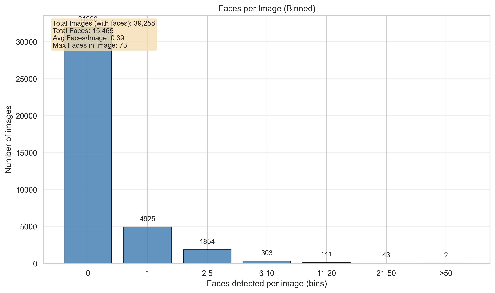
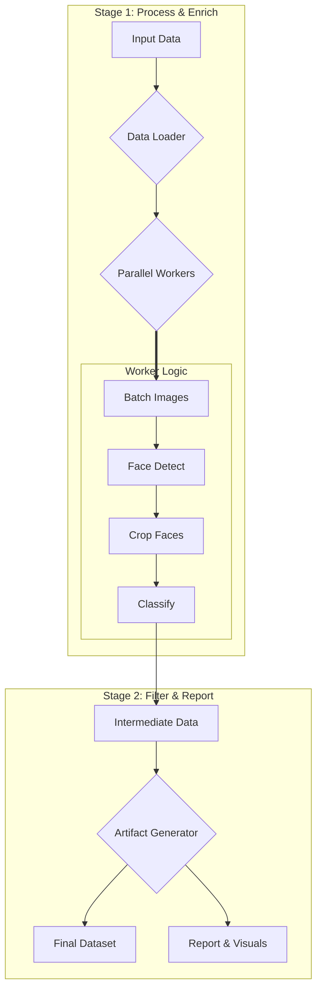

# Eyeglass Finder: A High-Throughput MLOps Pipeline

This project is a case study in engineering a production-grade, high-performance data pipeline to solve a challenging "needle-in-a-haystack" computer vision task. The system processes a vast, noisy image dataset to find rare instances of a specific feature: faces with eyeglasses.

| | | |
|:---:|:---:|:---:|
|  |  |  |
|  |  |  |

---

| 🚀 **17.09x Performance Increase** | 🏛️ **Production-Grade Architecture** | 🔬 **Deep Observability & Analytics** |
| :---: | :---: | :---: |
| Systematically optimized from a **9.8 images/sec** Docker baseline to over **167.5 images/sec** on native hardware—an order-of-magnitude speedup achieved through GPU acceleration, memory tuning, and advanced batching. | A decoupled, two-stage pipeline designed for scalability and maintainability. It automatically detects and leverages the best available hardware (NVIDIA CUDA, Apple MPS, or CPU) for optimal performance on any machine. | Every run generates a rich suite of artifacts, including detailed performance reports, system utilization plots, and extensive qualitative samples presented in browsable HTML galleries for deep model validation. |

---

### The Challenge: Finding a Needle in a Pre-Filtered Haystack

The goal was to process the Wikipedia-based Image Text (WIT) dataset, but with a significant, real-world complication: for user privacy, the dataset had already been **purposely scrubbed to remove images where human faces were the primary subject.** This transformed a standard filtering task into a true "needle-in-a-haystack" problem. The pipeline had to be sensitive enough to find the subtle, less prominent faces that remained.

The plot below visualizes this challenge, showing that the vast majority of images in the dataset contained zero detected faces, emphasizing the difficulty and precision required.

### The Solution: An Intelligent Two-Stage Pipeline

A decoupled, two-stage process was engineered for maximum performance, flexibility, and observability. This architecture separates the computationally expensive model inference from the lightweight filtering and reporting, allowing for rapid iteration on analytics without re-running the entire process.

---

### Key Engineering Decisions

This project showcases several senior-level engineering principles that prioritize modularity, data-driven decision-making, and maintainability.

1.  **Architecture: Why a Two-Stage Pipeline?**
    A two-stage pipeline (detection then classification) was chosen over a single end-to-end model to maximize modularity and debuggability. This allows for independent model updates (e.g., swapping in a new face detector) and makes it trivial to isolate the point of failure if a misclassification occurs. This design also creates an efficient funnel, where the lightweight detection stage rapidly filters data for the more intensive classification stage.

2.  **Strategy: A Data-Driven Pivot**
    Initial analysis revealed that a dual-classifier system (for `eyeglasses` and `sunglasses`) was counterproductive, with the sunglasses model aggressively removing valid targets. The architecture was strategically refactored to use a single, more precise classifier focused only on eyeglasses. This data-driven decision significantly improved accuracy and simplified the pipeline.

3.  **Deployment: Balancing Performance & Reproducibility**
    The project offers two distinct, well-supported environments. For maximum performance, a **native Python environment** unlocks a ~17x speedup on Apple Silicon via direct GPU access (MPS). For cross-platform validation and CI/CD, a fully containerized **Docker environment** guarantees perfect, one-command reproducibility.

---

### Sample Results

The pipeline successfully identifies a wide variety of eyeglasses across different face sizes, lighting conditions, and angles.

**➡️ View the full, browsable galleries from the latest run:**
- **[Final Targets Gallery](https://alpha-w0lf.github.io/eyeglass_finder/docs/latest_run_showcase/qualitative_analysis/final_targets/index.html)**
- **[False Negative Candidates Gallery](https://alpha-w0lf.github.io/eyeglass_finder/docs/latest_run_showcase/qualitative_analysis/false_negative_candidates/index.html)**

---

### Technology Stack

| Area | Technologies |
| :--- | :--- |
| **Core** | Python, PyTorch, Docker, Poetry |
| **Models** | YOLOv8-Face, `glasses-detector` |
| **Data** | Pandas, Apache Parquet |
| **Tooling** | Git, GitHub Actions, Mermaid |

---

### Project Documentation & Artifacts

For those interested in a deeper dive into the project's data, performance, and engineering process, the following documents provide comprehensive details:

- **[Latest Run Showcase](./docs/latest_run_showcase/report.md):** The full, detailed report from the most recent pipeline execution, including all performance metrics and visualizations.
- **[Post-Project Analysis Report](./post_run_report.md):** A detailed summary of the multi-phase optimization journey, from the initial baseline to the final high-performance state.
- **[Dataset Card](./dataset_card.md):** A formal summary of the output dataset, including schema, statistics, and run details, suitable for platforms like Hugging Face.
- **[Detailed Technical README](./README_detailed_depricated.md):** The original, verbose README with full setup and operational instructions.
