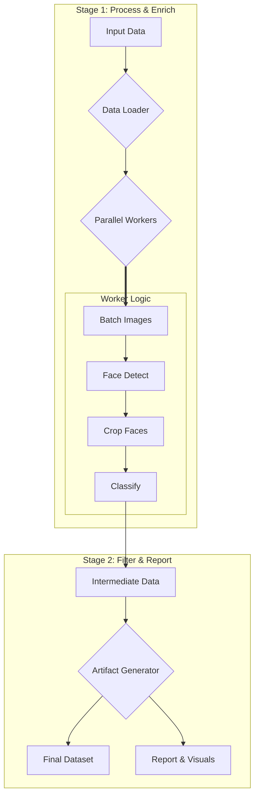

# Eyeglass Finder

Finding needles in a privacy-scrubbed haystack — a high-throughput **MLOps / computer-vision** pipeline that finds rare faces with eyeglasses in a vast, noisy dataset.

Case study in production-minded CV/MLOps under hard, privacy-scrubbed data constraints.

| | | |
|:---:|:---:|:---:|
|  |  |  |
|  |  |  |

---

### Results

| ~17× throughput | Architecture | Observability |
| :---: | :---: | :---: |
| Optimized from **9.8 images/sec** (Docker baseline) to **~167.5 images/sec** on native hardware via GPU acceleration, memory tuning, and batching. | Decoupled two-stage pipeline (detect → classify) with automatic hardware selection (CUDA, Apple MPS, or CPU). | Rich run artifacts: performance reports, system plots, and browsable HTML galleries for qualitative QA. |

### Quick start

```bash
poetry install
poetry run python scripts/process_data.py --config config/production.yaml
# Or Docker:
GIT_COMMIT_HASH=$(git rev-parse HEAD) docker compose build && docker compose run --rm app
```

Full setup, configs, and ops: [`docs/TECHNICAL.md`](docs/TECHNICAL.md).

---

### The Challenge: Finding a Needle in a Pre-Filtered Haystack

The goal was to process the Wikipedia-based Image Text (WIT) dataset, but with a significant, real-world complication: for user privacy, the dataset had already been **purposely scrubbed to remove images where human faces were the primary subject.** This transformed a standard filtering task into a true "needle-in-a-haystack" problem. The pipeline had to be sensitive enough to find the subtle, less prominent faces that remained.

The plot below visualizes this challenge, showing that the vast majority of images in the dataset contained zero detected faces, emphasizing the difficulty and precision required.


### The Solution: An Intelligent Two-Stage Pipeline

A decoupled, two-stage process was engineered for maximum performance, flexibility, and observability. This architecture separates the computationally expensive model inference from the lightweight filtering and reporting, allowing for rapid iteration on analytics without re-running the entire process.



---

### Key Engineering Decisions

This project showcases several senior-level engineering principles that prioritize modularity, data-driven decision-making, and maintainability.

1.  **Architecture: Why a Two-Stage Pipeline?**
    A two-stage pipeline (detection then classification) was chosen over a single end-to-end model to maximize modularity and debuggability. This allows for independent model updates (e.g., swapping in a new face detector) and makes it trivial to isolate the point of failure if a misclassification occurs. This design also creates an efficient funnel, where the lightweight detection stage rapidly filters data for the more intensive classification stage.

2.  **Strategy: A Data-Driven Pivot**
    Initial analysis revealed that a dual-classifier system (for `eyeglasses` and `sunglasses`) was counterproductive, with the sunglasses model aggressively removing valid targets. The architecture was strategically refactored to use a single, more precise classifier focused only on eyeglasses. This data-driven decision significantly improved accuracy and simplified the pipeline.

3.  **Deployment: Balancing Performance & Reproducibility**
    The project offers two distinct, well-supported environments. For maximum performance, a **native Python environment** unlocks a ~17x speedup on Apple Silicon via direct GPU access (MPS). For cross-platform validation and CI/CD, a fully containerized **Docker environment** guarantees perfect, one-command reproducibility.

---

### Sample Results

The pipeline successfully identifies a wide variety of eyeglasses across different face sizes, lighting conditions, and angles.

**View the full, browsable galleries from the latest run:**
- **[Final Targets Gallery](https://alpha-w0lf.github.io/eyeglass_finder/docs/latest_run_showcase/qualitative_analysis/final_targets/index.html)**
- **[False Negative Candidates Gallery](https://alpha-w0lf.github.io/eyeglass_finder/docs/latest_run_showcase/qualitative_analysis/false_negative_candidates/index.html)**

---

### Technology Stack

| Area | Technologies |
| :--- | :--- |
| **Core** | Python, PyTorch, Docker, Poetry |
| **Models** | YOLOv8-Face, `glasses-detector` |
| **Data** | Pandas, Apache Parquet |
| **Tooling** | Git, GitHub Actions, Mermaid |

---

### Docs

| Doc | Purpose |
|-----|---------|
| [Latest Run Showcase](./docs/latest_run_showcase/report.md) | Full report from the most recent pipeline run |
| [Post-Project Analysis](./docs/post_run_report.md) | Optimization journey from baseline to high performance |
| [Dataset Card](./dataset_card.md) | Output schema, statistics, run details |
| [Technical Reference](./docs/TECHNICAL.md) | Full setup and operational instructions |

Building similar high-throughput MLOps pipelines? Reach me on [LinkedIn](https://www.linkedin.com/in/tchacko1/).

**License:** PolyForm Noncommercial 1.0.0 — see [`LICENSE`](LICENSE) (source-available; not OSI open source).

*Last reviewed: 2026-08-02.*
