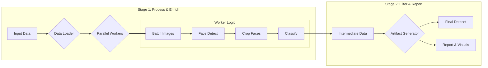

# Eyeglass Finder – Image Filtering Pipeline

This document provides a comprehensive overview of a production‑grade, fully reproducible data pipeline designed to identify faces and classify eyewear. It emphasizes reproducibility, scalability, and maintainability.

> ### tldr
>
> -   **The Goal:** Engineer a production-grade data pipeline to find a "needle-in-a-haystack": images of people wearing **eyeglasses** in a vast, noisy, pre-filtered dataset where faces are not the primary subject.
> -   **The Result:** A high-throughput, hardware-accelerated pipeline that achieved an **17.09x performance increase** over the initial Docker baseline, scaling from 9.8 to **167.5 images/second** on an M2 Max.
> -   **Run on Apple Silicon (Recommended for Performance):**
>     ```bash
>     # Install dependencies once
>     poetry install
>     # Run the two-stage pipeline
>     poetry run python scripts/process_data.py --config config/production.yaml
>     ```
> -   **Run with Docker (for Cross-Platform Reproducibility):**
>     ```bash
>     GIT_COMMIT_HASH=$(git rev-parse HEAD) docker compose build && docker compose run --rm app
>     ```
> -   **Key Highlights:**
>     -   **Extreme Performance Optimization:** Transitioned from a containerized CPU baseline to a native, GPU-accelerated pipeline on Apple Silicon, leveraging MPS, advanced batching, and memory architecture tuning for an order-of-magnitude speedup.
>     -   **Robust, Production-Ready Architecture:** A modular two-stage design, structured logging, dynamic memory management, and a comprehensive configuration system demonstrate best practices in MLOps.
>     -   **Deep Observability:** Every run generates a rich set of artifacts, including detailed performance reports, resource utilization plots, and extensive qualitative samples for data validation and model behavior analysis.
>     -   **Strategic Problem Solving:** Systematically diagnosed and resolved model performance issues, replacing a problematic dual-classifier approach with a more precise, config-gated "eyeglasses-only" model that improved accuracy and simplified the pipeline.
>
> This project is a case study in applying senior-level engineering principles to a real-world ML problem, emphasizing not just a functional outcome but the methodical process of optimization, diagnostics, and building a maintainable, production-grade system.

---

## Table of Contents

- [tldr](#tldr)
- [Project Overview](#project-overview)
- [Key Features](#key-features)
- [High-Level Architecture](#high-level-architecture)
- [Directory Structure](#directory-structure)
- [Design Rationale & Alternatives Considered](#design-rationale--alternatives-considered)
  - [Technology Stack Rationale](#technology-stack-rationale)
  - [Architectural Rationale](#architectural-rationale)
- [Setup and Installation](#setup-and-installation)
  - [Prerequisites](#prerequisites)
  - [Installation Steps](#installation-steps)
- [Running the Pipeline](#running-the-pipeline)
  - [Running the Application](#running-the-application)
  - [Running the Test Suite](#running-the-test-suite)
  - [Alternative Method: Native Python Environment](#alternative-method-native-python-environment)
  - [Hardware Acceleration Notes](#hardware-acceleration-notes)
  - [Configuration and Tuning](#configuration-and-tuning)
- [Output Dataset Schema](#output-dataset-schema)
  - [1. Intermediate Artifact: `annotated_faces.parquet`](#1-intermediate-artifact-annotated_facesparquet)
  - [2. Final Output: `filtered_dataset.parquet`](#2-final-output-filtered_datasetparquet)
  - [3. Diagnostic and Analysis Artifacts](#3-diagnostic-and-analysis-artifacts)
- [Scaling and Extensibility](#scaling-and-extensibility)
  - [The Path to Billions of Images: A Microservices Approach](#the-path-to-billions-of-images-a-microservices-approach)
  - [Designed for Extensibility](#designed-for-extensibility)
- [Limitations and Future Improvements](#limitations-and-future-improvements)
- [Project Links](#project-links)
- [Known Security Issues](#known-security-issues)

---

---

## Project Overview
The primary goal of this project is to showcase the engineering of a robust, scalable, and high-performance data pipeline to solve a challenging "needle-in-a-haystack" problem. It processes the Wikipedia-based Image Text (WIT) dataset—a collection already filtered to remove prominent faces—to identify the rare instances of individuals wearing eyeglasses.

The pipeline is engineered as a multi-stage ML system, separating heavy processing from final artifact generation:

1.  **Stage 1: Process & Enrich:**
    -   **Ingest** images from the source dataset using a memory-efficient streaming process.
    -   **Detect** all human faces using a hardware-accelerated YOLOv8-Face model.
    -   **Classify** each face with a fine-tuned model focused specifically on identifying clear eyeglasses.
    -   **Persist** this rich, unfiltered data to an intermediate Parquet file, capturing every detected face for full traceability.
2.  **Stage 2: Filter & Report:**
    -   **Load** the intermediate data from Stage 1.
    -   **Filter** the faces based on project criteria (e.g., face size, final classification).
    -   **Generate** a clean final dataset and a comprehensive suite of run artifacts, including a detailed Markdown report, performance visualizations, and qualitative image samples for validation.

> **Note on Classification Strategy:** Initial analysis revealed that a dual-classifier system (for `eyeglasses` and `sunglasses`) was counterproductive, with the sunglasses model aggressively removing valid targets. The architecture was strategically refactored to use a single, more precise classifier focused only on eyeglasses. This improved accuracy and demonstrates a data-driven approach to model deployment. The legacy dual-classifier logic remains available and can be re-enabled via the configuration file for future experimentation.

This project emphasizes not only the functional outcome but also the engineering discipline required for a production-grade research environment. It is designed to be reproducible, well-documented, and built upon a foundation that is both scalable and extensible.

## Key Features
-   **Extreme Performance Engineering:** Methodically optimized the pipeline from a 9.8 images/sec Docker baseline to **over 167 images/sec** on Apple Silicon—an **17.09x improvement**. This was achieved through a multi-faceted approach including native execution, MPS GPU acceleration, worker scaling, memory architecture tuning, and batch processing.
-   **Hardware-Aware Execution:** The pipeline automatically detects and utilizes the best available hardware—NVIDIA (CUDA), Apple (MPS), or CPU—ensuring optimal performance on any machine with zero configuration changes.
-   **Production-Grade Architecture:** Employs a modular two-stage pipeline that decouples expensive model inference from lightweight reporting. This enhances flexibility, simplifies debugging, and allows for rapid iteration on filtering logic and analytics without re-running the entire process.
-   **Deep Observability & Rich Reporting:** Every run is treated as a reproducible experiment, generating a unique, timestamped output directory. Artifacts include a detailed Markdown report with performance analytics, system resource utilization plots (CPU, Memory, Disk I/O), worker efficiency histograms, and structured JSON logs for production monitoring.
-   **Advanced Qualitative Analysis:** Generates extensive qualitative samples to validate model behavior, including final targets, false negative candidates, and images with high face counts. Samples are presented in browsable HTML galleries with embedded metadata like confidence scores. See the latest results here:
    -   **[Final Targets Gallery](https://alpha-w0lf.github.io/eyeglass_finder/docs/latest_run_showcase/qualitative_analysis/final_targets/index.html)**
    -   **[False Negative Candidates Gallery](https://alpha-w0lf.github.io/eyeglass_finder/docs/latest_run_showcase/qualitative_analysis/false_negative_candidates/index.html)**
-   **Intelligent Memory Management:** Includes a dynamic `MemoryManager` that monitors memory pressure in real-time, automatically throttling data prefetching and triggering garbage collection to ensure stability during high-load processing, even with 10+ parallel workers.
-   **Robust & Reproducible Environments:** Offers two execution paths to fit the need: a high-performance native Poetry environment for development and a fully containerized Docker environment that guarantees perfect, one-command reproducibility for cross-platform validation.
-   **Designed for Scale:** The single-machine architecture is built with a clear, documented roadmap for evolving into a distributed, asynchronous microservices system capable of processing billions of images.

## High-Level Architecture

The pipeline follows a decoupled, two-stage process designed for enhanced observability, flexibility, and easier debugging.



1.  **Stage 1 (`process_data.py`):** This script is responsible for the heavy lifting. It processes all input images, runs the expensive face detection and classification models, and saves all detected faces—regardless of whether they meet the target criteria—into a single, rich intermediate Parquet file. It also captures detailed metadata and performance metrics for the run.
2.  **Stage 2 (`generate_run_artifacts.py`):** This lightweight script consumes the intermediate data from Stage 1. It is responsible for all post-processing: filtering the data to produce the final dataset, generating the summary report, creating performance visualizations, and saving qualitative image samples.

This decoupled design means that if you want to change a plot or adjust a filter threshold, you only need to re-run the fast, lightweight second stage, not the time-consuming model inference stage.

## Directory Structure
```
.
├── .dockerignore         # Specifies files to exclude from the Docker build context.
├── .gitignore            # Specifies intentionally untracked files to ignore.
├── config/
│   └── config.yaml     # Central configuration file for the entire pipeline.
├── data/                 # Directory for all datasets.
│   ├── raw/            # Input location for the raw Parquet files from WIT.
│   └── ...             # Other subdirectories for test or intermediate datasets.
├── docs/                 # All project documentation and planning files.
├── models/               # Pre-trained model weights.
│   ├── yolov8n-face-lindevs.pt # The "nano" variant of the YOLOv8-Face model.
│   └── yolov8s-face.pt # The "small" variant of the YOLOv8-Face model.
├── notebooks/
│   └── .gitkeep        # For exploratory data analysis (EDA) and model prototyping.
├── outputs/
│   └── .gitkeep        # Default output directory for all pipeline runs.
├── scripts/
│   ├── create_test_dataset.py    # Utility to create a smaller test set from raw data.
│   ├── generate_run_artifacts.py # Stage 2: Generates reports from intermediate data.
│   └── process_data.py   # Stage 1: Processes images and runs models.
├── src/
│   ├── data_processing/  # Modules for data loading, chunking, and schema management.
│   ├── modeling/         # Modules for wrapping the ML models (face detector, classifier).
│   ├── processing/       # Core pipeline logic for orchestrating workers and processing.
│   ├── reporting/        # Module for generating the final Markdown report.
│   └── utils/            # Shared utilities (config, logging, metrics, visualizations).
├── tests/                # Automated test suite (currently obsolete).
│   └── ...
├── docker-compose.yml    # Orchestrates running the application and test containers.
├── Dockerfile            # Recipe for building the reproducible application container.
├── poetry.lock           # Exact dependency versions for reproducible builds.
├── pyproject.toml        # Project metadata and dependencies for Poetry.
└── pytest.ini            # Configuration for the Pytest testing framework.
```

## Design Rationale & Alternatives Considered

This section details the engineering rationale behind the implementation, focusing on the "why" behind key choices and documenting the alternatives that were considered and rejected. This demonstrates a deliberate and informed design process.

> **Performance Optimization Note:** The performance gains documented in this project came from systematic analysis of hardware utilization, dependency optimization, and algorithmic improvements across multiple optimization phases — detailed in [Post-Project Analysis](./post_run_report.md).

### Technology Stack Rationale

| Component                 | Technology                                       | Rationale & Alternatives Considered                                                                                                                                                                                                                            |
| ------------------------- | ------------------------------------------------ | -------------------------------------------------------------------------------------------------------------------------------------------------------------------------------------------------------------------------------------------------------------- |
| Language                  | Python 3.12+                                     | A hard requirement from the `glasses-detector` library. Using a modern version of Python is best practice.                                                                                                                                                     |
| Containerization          | Docker & Docker Compose                          | **Alternative:** Native local environment. <br> **Decision:** Rejected for being non-reproducible. Containerization guarantees a perfectly consistent environment across any machine, solving the "works on my machine" problem, which is critical for MLOps.          |
| Dependency Management     | Poetry                                           | **Alternative:** `pip` and `requirements.txt`. <br> **Decision:** Poetry provides superior, deterministic dependency resolution via its lock file, preventing subtle version conflicts that can break production systems. It is the modern standard for robust Python projects. |
| Core ML Framework         | PyTorch                                          | The entire pipeline leverages PyTorch. The `glasses-detector` uses it directly, and the `YOLOv8-Face` model is loaded via the `ultralytics` library, which is built on PyTorch. This provides broad hardware support (CUDA/MPS/CPU) and optimal inference speed.       |
| Data Format               | Apache Parquet                                   | **Alternative:** CSV. <br> **Decision:** Parquet is a columnar storage format offering significantly better performance and compression than CSV for large datasets. It enforces a schema, reducing the risk of data corruption.                                 |

> For a detailed justification of our model architecture and specific model choices, please see **[docs/architecture.md](./architecture.md)**.

### Architectural Rationale

#### Two-Stage Pipeline vs. Single-Stage Object Detector

A key architectural decision was to use a two-stage pipeline (detection then classification) instead of a single, end-to-end object detection model that might find "faces with glasses."

-   **Why We Chose a Two-Stage Pipeline:**
    -   **Modularity & Flexibility:** Each model can be updated, fine-tuned, or replaced independently. If a better face detector becomes available, we can swap it in without touching the classifier.
    -   **Leverages Best-of-Breed Models:** It allows us to use models that are highly specialized for their specific task. `YOLOv8-Face` is excellent at finding faces and landmarks, while `glasses-detector` is purpose-built for its classification task.
    -   **Improved Debuggability:** If an image is misclassified, it's easy to isolate the point of failure: did the detector fail to find the face, or did the classifier make an incorrect prediction? This is much harder with a single monolithic model.
    -   **Efficiency Funnel & Batch Processing:** The lightweight face detection stage acts as a rapid filter. This design is highly efficient because it allows for optimized batch processing at both stages: large batches of images are fed to the detection model, and the smaller set of resulting face crops can then be processed as a single, optimized batch by the classification models.

#### YOLOv8-Face vs. Other Face Detectors (e.g., RetinaFace, YuNet)

-   **Why We Chose `YOLOv8-Face`:**
    -   The single most important reason was its ability to predict **5 facial landmarks** (eye centers, nose tip, mouth corners) in the same forward pass as detection. This provides a rich set of data for each face and was a key factor in its selection, offering capabilities on par with other advanced detectors like `RetinaFace`.
    -   While these landmarks can be used for advanced applications like face alignment, the current pipeline uses a more robust **crop-and-resize** strategy. An earlier implementation that used an affine transformation for alignment was found to be brittle, especially for faces near image borders. The availability of landmarks, however, provides a clear path for future enhancements.
    -   `YOLOv8-Face` is delivered via the `ultralytics` library, which is modern, robust, and exceptionally easy to use. This removes the significant implementation and portability issues we encountered with other libraries, making it a superior choice from an engineering perspective.
    -   The default configuration uses the **`YOLOv8n-Face` ("nano")** variant. It is significantly smaller and faster than the "small" variant, and the minor trade-off in accuracy is acceptable for this project's requirements. That said, to maximize portability and flexibility, both the "nano" and "small" models are included in the repository and can be easily switched via `config.yaml`.
    -   The specific `YOLOv8-Face` models used in this project were developed by **[Lindevs](https://github.com/lindevs/yolov8-face)** and trained on the well-known **WIDERFace dataset**, providing a strong foundation of performance on a diverse range of faces.

#### Scalable Single-Machine Processing: A "Stream, Chunk, and Batch" Strategy
The pipeline is engineered to handle datasets that are far too large to fit into memory. Instead of loading an entire Parquet file at once, it uses a more robust and scalable approach.

-   **Why It Matters:** This design ensures that the pipeline's memory usage remains low and constant, regardless of whether the input file is 1 GB or 100 GB. It is a critical feature for processing large-scale datasets efficiently on a single machine.
-   **How It Works:**
    1.  **Stream from Disk:** The application streams the input Parquet file from disk in large, memory-efficient chunks.
    2.  **Batch for Inference:** From each chunk, smaller batches of images are created and sent to the models for inference. This is highly efficient as it maximizes the parallel processing capabilities of modern hardware (CPUs and GPUs), even in a serial execution flow.

#### A Note on Performance Monitoring
The pipeline includes a built-in monitoring suite that provides deep insight into its performance characteristics. During execution, it automatically records system-level metrics (CPU, memory, I/O) and application-level metrics (per-worker processing time). This data provides empirical evidence of the system's performance, helps identify potential bottlenecks, and validates the efficiency of the parallel processing architecture.

For example, the following plot from a production run on an M2 Max shows stable resource utilization and the initial ramp-up period, demonstrating a well-behaved system under load:


#### A Note on CPU-Specific Optimization
While the primary path for performance scaling is through GPU acceleration (NVIDIA CUDA or Apple MPS), we also considered advanced CPU optimization strategies. For instance, frameworks like `ONNX Runtime` can offer enhanced CPU performance through parallel execution providers. However, enabling this often requires building the runtime from source with specific flags, a process that adds significant time and complexity to the Docker build and can compromise portability.

Given that the ultimate goal for a production system is GPU-based scaling, we made a deliberate decision to prioritize a simple, clean, and highly portable Docker environment over pursuing complex, CPU-specific optimizations that offered diminishing returns for this project's scope.

#### Pre-trained `glasses-detector` vs. Training a Custom Model

-   **Why We Chose a Pre-trained Model:**
    -   The primary reason was **pragmatism and efficiency**. The open-source [`glasses-detector`](https://github.com/mantasu/glasses-detector) package directly solves the project's most difficult constraint: explicitly distinguishing between `eyeglasses` and `sunglasses`.
    -   Collecting, labeling, and cleaning a high-quality dataset to train a custom classification model from scratch is a massive undertaking, often taking weeks or months. Using an effective pre-trained model is a huge project accelerator and a common practice when available.

## Setup and Installation
This project offers two distinct, well-supported environments to balance the needs of performance and reproducibility.

### Environment Options

1.  **Native Python Environment (Recommended for Apple Silicon & Performance)**
    -   **Use Case:** The primary path for development and achieving maximum performance, especially on Apple Silicon (M1/M2/M3/M4) where it enables direct GPU access.
    -   **Performance:** Unlocks an **~17x performance increase** (167+ vs. 9.8 images/sec) via Metal Performance Shaders (MPS).
    -   **Setup:** Managed by [Poetry](https://python-poetry.org/) for robust dependency management.

2.  **Docker Environment (Recommended for Cross-Platform Reproducibility)**
    -   **Use Case:** When perfect, bit-for-bit reproducibility across different machines (Linux, Windows, Intel Macs) is the top priority. Ideal for CI/CD pipelines or sharing with collaborators.
    -   **Performance:** CPU-only on macOS due to virtualization limits. Can leverage NVIDIA GPUs on Linux/WSL2 with the NVIDIA Container Toolkit.
    -   **Setup:** Managed by Docker and Docker Compose for a one-command build and run experience.

### Prerequisites
-   [Git](https://git-scm.com/downloads)
-   **For Native Environment:**
    -   [Python 3.12+](https://www.python.org/downloads/)
    -   [Poetry](https://python-poetry.org/docs/#installation)
-   **For Docker Environment:**
    -   [Docker](https://docs.docker.com/get-docker/)
    -   [Docker Compose](https://docs.docker.com/compose/install/) (Typically included with Docker Desktop)

> **Note:** For the Docker environment, ensure the Docker daemon is running. On macOS and Windows, this means starting Docker Desktop.

### Installation Steps
1.  **Clone the repository:**
    ```bash
    git clone https://github.com/Alpha-W0lf/eyeglass_finder.git
    cd eyeglass_finder
    ```

2.  **Download the data:**
    Download the required Parquet files from the [WIT dataset on Hugging Face](https://huggingface.co/datasets/wikimedia/wit_base/tree/main/data). The pipeline is configured to process any files matching the pattern `train-*.parquet`. For the documented runs, the following files were used:
    -   `train-00000-of-00330.parquet`
    -   `train-00001-of-00330.parquet`
    
    Place the downloaded files into the `data/raw/` directory.

3.  **Set up your chosen environment:**
    -   **For Native Environment:**
        ```bash
        poetry install
        ```
    -   **For Docker Environment:**
        No separate installation step is needed. Dependencies will be installed when the image is built.

## Running the Pipeline
The pipeline is executed differently depending on your chosen environment.

### 1. Native Python Environment (High Performance)
This is the recommended method for development and for users on Apple Silicon seeking maximum performance. The two stages of the pipeline are run sequentially.

1.  **Run Stage 1 (Processing):**
    This script performs the heavy-lifting of model inference and creates a new, timestamped output directory (e.g., `outputs/run_2025-08-18_15-30-00/`). We recommend using the production-tuned [config/production.yaml](../config/production.yaml) configuration.
    ```bash
    poetry run python scripts/process_data.py --config config/production.yaml
    ```

2.  **Run Stage 2 (Artifact Generation):**
    This script processes the intermediate data to generate the final report and samples. By default, it automatically finds and uses the **most recent** run directory.
    ```bash
    poetry run python scripts/generate_run_artifacts.py
    ```

    To re-run artifact generation for a **specific** previous run, pass its path using the `--run_dir` argument:
    ```bash
    poetry run python scripts/generate_run_artifacts.py --run_dir outputs/<your-specific-run-id>/
    ```

### 2. Docker Environment (Reproducibility)
This method guarantees a perfectly reproducible environment using Docker Compose.

```bash
GIT_COMMIT_HASH=$(git rev-parse HEAD) docker compose build && docker compose run --rm app
```

> **Note on Reproducibility:** The `GIT_COMMIT_HASH` variable is a critical MLOps practice. It embeds the current Git commit hash into the Docker image, linking the output artifacts directly to the exact version of the source code that created them.

-   `build`: Builds the Docker image. Run this the first time or when dependencies in `pyproject.toml` change. To force a rebuild without cache, add the `--no-cache` flag.
-   `run --rm app`: Runs the main pipeline service inside a container. The `--rm` flag ensures the container is removed after execution to keep your system clean.

### Running the Test Suite
> **Warning: Obsolete Test Suite**
> The test suite for this project (`tests/`) has not been updated to reflect the latest significant architectural refactors. As a result, the tests are currently failing and should not be considered a reliable measure of the application's correctness. They remain as a foundation for a future refactoring effort.

To run the test suite (which is expected to fail), you can use the following command:
```bash
docker compose run --rm test
```

### Hardware Acceleration Notes
The application code is fully hardware-aware and engineered for optimal performance on different platforms.

#### **Apple Silicon (M1/M2/M3/M4) - PERFORMANCE OPTIMIZED**
-   **Native Execution (Recommended):** Provides a **~17x performance increase** by leveraging the full capabilities of Apple Silicon, including GPU acceleration via Metal Performance Shaders (MPS) and the unified memory architecture.
-   **Docker (CPU-Only):** Provides reproducibility but is limited to CPU-only processing due to Docker's virtualization constraints on macOS.

#### **NVIDIA GPU Systems**
-   **Docker + NVIDIA Container Toolkit:** Full GPU acceleration is available on Linux/WSL2.
    -   **Requirement:** [NVIDIA Container Toolkit](https://docs.nvidia.com/datacenter/cloud-native/container-toolkit/latest/install-guide.html) must be installed.
    -   **Configuration:** Uncomment the `deploy` section in `docker-compose.yml` to enable GPU access for the container.
-   **Native Execution:** Also a viable path for maximum GPU utilization if the environment is configured manually.

#### **CPU-Only Systems**
-   **Docker (Recommended):** Guarantees reproducibility across all platforms (e.g., Intel Macs, Windows without WSL2, Linux without NVIDIA GPUs).
-   **Native Execution:** An alternative for development convenience.

#### **Automatic Device Selection**
The pipeline intelligently assigns models to the best available hardware in the following priority order: **NVIDIA CUDA → Apple MPS → CPU**. This ensures that you get the best possible performance automatically, with no need for manual configuration.

> **A Note on the Future of Containers on macOS:** We are aware that at WWDC 2025, Apple announced a native Containerization framework for future versions of macOS. Once this technology matures, it is expected to provide direct GPU access to containers, which would eliminate the need for the native Python workaround for Apple Silicon users. This project is well-positioned to adopt this new framework, which would further simplify cross-platform development and deployment.

### Configuration and Tuning
The entire behavior of the pipeline is controlled by a single, well-documented configuration file located at `config/config.yaml`. This approach separates the core logic from the operational parameters, allowing for easy experimentation and tuning without modifying the source code.

> **A Note on the Default Settings**
>
> The default values in `config.yaml` have been carefully chosen to ensure a high-quality output and a smooth, successful first-run experience on a wide variety of hardware. They generally prioritize precision over recall (e.g., higher confidence thresholds) to build a clean, reliable dataset.

You can easily modify this file to suit your needs. For example, to find more potential faces at the cost of including more false positives, you could lower the `min_confidence` value in the `face_detection` section.

The configuration is split into several logical sections:
-   `paths`: Defines all input and output locations.
-   `data_processing`: Controls how data is chunked and batched.
-   `model_params`: Contains all parameters for model inference, including confidence thresholds and filtering logic.
-   `execution`: Manages parallel processing settings.
-   `logging`: Configures the logging level for the application.
-   `report_generation`: Controls parameters for the final report, like the number of qualitative samples.

#### Typed Config Usage (Senior-friendly API)
Configuration is parsed into a typed dataclass tree (`AppConfig`) for clarity and maintainability. All application code uses attribute access, not dict indexing.

Example:

```python
from src.utils.config import load_config, AppConfig

config: AppConfig = load_config("config/config.yaml")

# Attribute access throughout the codebase
input_dir = config.paths.input_dir
pattern = config.data_processing.file_pattern
num_workers = config.execution.num_workers
fd_model_path = config.model_params.face_detection.model_path

# For serializing into metadata or logs:
from dataclasses import asdict
config_snapshot = asdict(config)
```

To increase logging verbosity at runtime, set `logging.level: "DEBUG"` in `config/config.yaml`.

## Output Dataset Schema
The pipeline's two-stage design produces two key data outputs, located in `outputs/<run-id>/`, where `<run-id>` is a unique ID for each pipeline execution. The schemas for these files are different, as they serve different purposes.

### 1. Intermediate Artifact: `annotated_faces.parquet`
This is the primary data output from the first stage of the pipeline. It is a rich, detailed dataset containing one row for **every single face** that was detected and met the minimum size criteria. This "catch-all" approach is invaluable for debugging and data analysis, as it provides a complete picture of what the model processed before final filtering. Its schema is implicitly defined by the data processing script.

| Column | Type | Description |
| :--- | :--- | :--- |
| `image_url` | `string` | The original URL of the source image for traceability. |
| `source_file` | `string` | The name of the input Parquet file where the image was sourced. |
| `image_width` | `int` | The width of the original source image in pixels. |
| `image_height` | `int` | The height of the original source image in pixels. |
| `original_image_mode` | `string` | The Pillow image mode (e.g., "RGB", "L") of the source image. |
| `face_bbox` | `list[int]` | `[x_min, y_min, x_max, y_max]` coordinates of the detected face. |
| `face_width` | `float` | The width of the face bounding box in pixels. |
| `face_height` | `float` | The height of the face bounding box in pixels. |
| `face_score` | `float` | The confidence score from the face detection model. |
| `eyeglasses_prediction` | `boolean` | Final prediction from the `eyeglasses` classifier. |
| `sunglasses_prediction` | `boolean` | Final prediction from the `sunglasses` classifier. |
| `is_target` | `boolean` | The final decision: `True` if the face is the target class. |
| `cropped_face_jpeg` | `bytes` | Binary data of the cropped and resized face (JPEG format). |
| `detection_time_seconds`| `float` | The per-face time spent in the detection stage. |
| `classification_time_seconds`| `float` | The per-face time spent in the classification stage. |


### 2. Final Output: `filtered_dataset.parquet`
This is the final, user-facing dataset. It is a cleaned and validated version of the intermediate artifact. The artifact generation script first filters the intermediate data for rows where `is_target` is `True`, then selects and renames a subset of the columns to create a more concise final output.

| Column | Type | Description |
| :--- | :--- | :--- |
| `image_url` | `string` | The original URL of the source image for traceability. |
| `source_file` | `string` | The name of the input Parquet file where the image was sourced. |
| `face_bbox` | `object` | `[x_min, y_min, x_max, y_max]` coordinates of the detected face. |
| `face_confidence` | `float` | The confidence score from the face detection model. |
| `face_jpeg` | `bytes` | Binary data of the cropped and resized face (JPEG format). Renamed from `cropped_face_jpeg`. |

### 3. Diagnostic and Analysis Artifacts
Beyond the core datasets, each pipeline run generates comprehensive diagnostic artifacts designed to provide deep insights into face detection patterns and model behavior. These artifacts support the iterative improvement process and help validate pipeline performance.

#### Comprehensive Reporting (`report.md`)
Every run produces a detailed Markdown report featuring:
- **Executive Summary**: Human-readable face count distribution with percentages and categorization (no faces, single faces, small groups, large groups/crowd scenes)
- **Enhanced Data Funnel**: Complete processing pipeline metrics including the new "Images with Faces" metric for improved clarity
- **Performance Analytics**: Worker efficiency, system resource utilization, and processing time distributions
- **Quality Analysis**: Face detection confidence distributions, size analysis, and model performance metrics

#### Face Detection Diagnostics
The pipeline automatically identifies and analyzes face detection patterns:
- **Face Count Distribution Visualization**: Bar chart showing the distribution of faces per image with statistical overlays
- **High Face Count Image Sampling**: Automatic identification and preservation of images with >5 detected faces for manual inspection
- **Diagnostic Image Collection** (`qualitative_analysis/high_face_count_images/`): Up to 20 images with the highest face counts, saved as JPEG files with descriptive filenames indicating face count
- **Diagnostic Summary** (`README.txt`): Detailed analysis document listing all high face count images with URLs and face counts for investigation

#### Qualitative Analysis Samples
- **Final Target Samples**: Representative examples of faces meeting all filtering criteria
- **Rejected Sunglasses Samples**: Examples of faces rejected by the sunglasses classifier for failure analysis
- **Visualization Suite**: Complete set of diagnostic plots including confidence histograms, face size distributions, and system performance metrics

#### Technical Artifacts
- **Intermediate Data Preservation** (`high_face_count_images.pkl`): Binary storage of high face count images with metadata for offline analysis
- **Resource Monitoring** (`resource_utilization.json`): Detailed system performance data captured throughout the run
- **Structured Metadata** (`run_metadata.json`): Complete run configuration and metrics in machine-readable format

This comprehensive diagnostic framework transforms each pipeline run into a rich source of insights, supporting both immediate quality evaluation and long-term iterative improvement of the face detection and classification models.

## Scaling and Extensibility
This project was intentionally designed as a robust foundation that can be evolved into a production-grade, web-scale system. A multi-phase evolution path beyond single-machine scaling addresses the key pillars of enterprise-ready MLOps, including:

-   **Advanced Observability:** Monitoring for data drift and implementing model explainability.
-   **Model & Data Governance:** Using model and schema registries to ensure reproducibility and prevent pipeline failures.
-   **Cost Optimization:** Employing strategies like Spot Instances and intelligent autoscaling.

The immediate path to scale, however, begins with a shift to a distributed microservices architecture.

### The Path to Billions of Images: A Microservices Approach
The current single-script pipeline is not suitable for processing billions of files. To handle that scale, we would evolve this system into a distributed, asynchronous architecture based on microservices. This is the industry standard for resilient MLOps systems.

1.  **Model Containerization:** Each model (face detector, eyeglass classifier) would be packaged into its own Docker container, exposing a simple API endpoint (e.g., `POST /detect-faces`).
2.  **Asynchronous Task Orchestration:** A message queue (like **Apache Kafka** or **RabbitMQ**) would replace the linear `for` loop. A producer would populate a queue with image locations.
3.  **Dedicated Worker Groups:** Fleets of servers (or Kubernetes pods), each running a specific model service, would pull tasks from the queue, perform their function, and push resulting tasks onto downstream queues (e.g., a `face-classification-queue`).
4.  **Scalable Storage:** Raw data would live in a cloud object store like **Amazon S3**, and results would be written to a scalable, searchable database like **Elasticsearch** or a properly indexed **PostgreSQL**.
5.  **Deployment & Management:** The entire ecosystem would be managed by an orchestrator like **Kubernetes**, which can automatically scale the number of worker pods based on queue length.

### Designed for Extensibility
This microservices architecture is inherently extensible. Adding a new filter—for example, a "beard detector"—would require **zero modification to the existing pipeline**. The process would be:
1.  Train or acquire a beard detection model.
2.  Package it into a new `Beard Classifier` microservice.
3.  Deploy a new group of workers running this service.
4.  Subscribe these workers to the exact same `face-classification-queue`.

Both the eyeglass workers and beard workers would then process face crops in parallel, writing their respective results to the database. This design enables the rapid and independent addition of new filtering capabilities.

## Limitations and Future Improvements
A robust engineering project acknowledges its limitations and outlines a clear path for future work. This section discusses the outcomes of the current pipeline and proposes strategic next steps, demonstrating a commitment to continuous, data-driven improvement.

-   **Input Dataset Characteristics — A Challenging Real-World Problem:** The pipeline was successfully executed on a sample of the `wikimedia/wit_base` dataset, a collection known for its vast and uncurated nature. This task was made significantly more challenging by the dataset's own curation process: for privacy reasons, the original creators had already removed images where human faces were a primary subject. This left our pipeline to solve a true "needle in a haystack" problem, searching for the subtle or less prominent faces that remained. Processing **39,258 images** to find **125 target faces** (~0.32% of source images) on the canonical public run not only confirms the pipeline is functional but also demonstrates its robustness in extracting a rare signal from a noisy, pre-filtered source.

-   **Model Accuracy and Bias:** The pre-trained models, while effective, are not perfect. There will inevitably be false positives (e.g., reflections misidentified as glasses) and false negatives. The confidence scores and qualitative samples (including `false_negative_candidates`) are provided specifically to allow for deep analysis of the model's performance on this specific domain. Furthermore, because the WIT dataset is sourced from Wikipedia, it has known demographic and geographic biases, which will be reflected in the models' performance and the final filtered dataset.

-   **Strategic Next Steps & A Vision for Iterative Improvement:** The current system provides a strong foundation designed for continuous evolution. The rich output artifacts from each run are the fuel for a **structured, iterative improvement loop**. Key initiatives would include:
    -   **Reactivate and Modernize the Test Suite:** The existing test suite is currently obsolete due to a major architectural refactor. A high-priority next step is to update the tests to align with the current two-stage pipeline, ensuring long-term reliability and maintainability. This is a critical piece of technical debt to address.
    -   **Address the Model Domain Gap via Fine-Tuning:** The accuracy of the pre-trained models is likely constrained by a "domain gap"—a mismatch between the data they were originally trained on (likely clean, well-lit portraits) and the "in-the-wild" nature of the WIT dataset. A formal fine-tuning strategy, starting with simple last-layer tuning and potentially moving to full model fine-tuning, is a high-priority next step to improve precision and recall.
    -   **Implement a Human-in-the-Loop (HITL) Workflow:** A more advanced MLOps system would include a human review process for low-confidence predictions or identified false negatives. These reviewed examples would create a continuous stream of new, high-quality training data, providing the ideal fuel for the fine-tuning efforts described above.
    -   **Enhanced Preprocessing and Multimodal Filtering:** Beyond model-centric improvements, significant gains could be achieved by enhancing the data preprocessing pipeline itself. Future iterations could incorporate:
        -   **Advanced Face Processing:** Developing a more robust face alignment strategy using the available landmarks and adding head pose estimation to filter out faces at extreme angles, which are difficult to classify reliably.
        -   **Leveraging Textual Metadata:** The WIT dataset's rich textual metadata is currently unused. A powerful enhancement would be to implement text-based heuristics (e.g., flagging images with the caption "sunglasses") or evolve the system toward a true multimodal approach using models like CLIP to filter images based on the semantic similarity between the image and text descriptions.

## Project Links
*(Primary repository link.)*

- **GitHub Repository:** https://github.com/Alpha-W0lf/eyeglass_finder

---

## Known Security Issues

- **`torch==2.3.1` Vulnerability**: The project currently uses `torch==2.3.1`, which has a known security vulnerability. We are locked into this specific version because the `torchvision==0.18.1` package, a critical dependency for the models used in this pipeline, has a strict requirement for it. Upgrading `torch` independently would break the environment and could compromise the validity of the model's predictions. We will continue to monitor the upstream packages and will upgrade to a secure version as soon as a compatible and stable release of `torchvision` becomes available.
