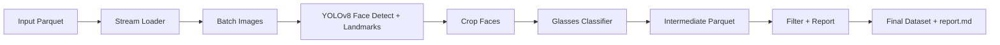

# Architecture

## Components

- Data Layer
  - Parquet streaming loader, chunking utilities, schema validation (optional)
- Modeling
  - Face detector wrapper (YOLOv8-Face via ultralytics)
  - Eyewear classifier wrapper (glasses-detector)
- Processing
  - Worker orchestrating detection + classification
  - Pipeline controller coordinating chunked processing and batching
- Reporting
  - Report generator (markdown + plots), visualizations, artifact generation script

## Data Flow

1. Load input parquet in streamed chunks
2. For each chunk, batch images → detect faces + landmarks → crop → classify
3. Persist intermediate annotated faces parquet
4. Load intermediate → filter → output final dataset and generate report

## Configuration

- Centralized in `config/config.yaml`
- Controls paths, batching, thresholds, model params, and device selection
- Model weights path must be repo-copied or absolute local paths

## Mermaid (placeholder)

