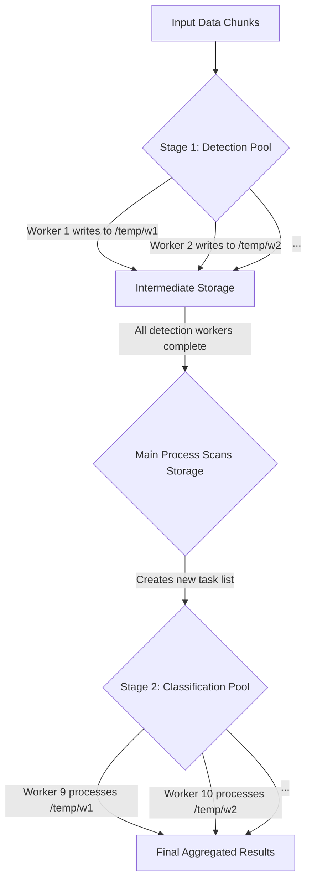

# Implementation Plan: Two-Stage Worker Pool Architecture

## 1. High-Level Goal

To refactor the pipeline from a single, monolithic worker pool into a two-stage architecture with dedicated pools for detection and classification. This will provide complete process isolation between the conflicting `ultralytics` and `glasses-detector` libraries, definitively resolving the persistent worker hang.

## 2. Architectural Overview

The new architecture will function as a sequence of two independent processing stages orchestrated by the main process in `scripts/process_data.py`.

-   **Stage 1 (Detection Pool):** A pool of workers is created. Each worker loads *only* the face detection model. It processes a chunk of raw image data, performs detection, and writes all its outputs (face images, metadata, diagnostics) to a unique temporary subdirectory (e.g., `outputs/run_.../temp_worker_data/worker_PID/`). Once its task is complete, the worker process terminates cleanly.
-   **Data Handoff:** The main process waits for all detection workers to complete. It then scans the `temp_worker_data` directory to discover all the subdirectories created by the detection workers. These subdirectory paths become the new "chunks" of work for the next stage.
-   **Stage 2 (Classification Pool):** A brand new, fresh pool of workers is created. Each worker loads *only* the eyeglass/sunglass classification models. It receives a path to one of the temporary worker directories, reads the face metadata and images, performs classification, and writes its final outputs back to the same directory.

## 3. Detailed Implementation Steps

### Step 1: Refactor `src/processing/worker.py` for Task-Specific Roles

The current `process_chunk_of_data` and `initialize_worker` functions are monolithic. They will be split into specialized versions for each stage.

-   **Create `initialize_detection_worker(config, lock)`:**
    -   This function will only load `g_face_detector`.
-   **Create `run_detection_worker(chunk, config)`:**
    -   This function will contain the logic for processing a chunk of raw images.
    -   It will call `detect_and_crop_faces`.
    -   It will return only a minimal success/failure status and metrics, as all data is persisted directly to its unique temp directory.
-   **Create `initialize_classification_worker(config, lock)`:**
    -   This function will only load `g_glasses_classifiers`.
-   **Create `run_classification_worker(worker_data_dir, config)`:**
    -   This function's "chunk" of work is now a single path to a temporary directory created by a detection worker.
    -   It will scan this directory to find all `*_metadata.json` files for the faces it needs to process.
    -   It will call `classify_faces`.
    -   It will write its output (final results, audit logs) back into the same directory.

### Step 2: Refactor `scripts/process_data.py` to Orchestrate the Two Pools

This file will contain the main orchestration logic.

-   **Implement Detection Stage:**
    -   Create the first `ProcessPoolExecutor` initialized with `initialize_detection_worker`.
    -   Submit all the raw data chunks from the `stream_data_generator` to this pool, calling `run_detection_worker`.
    -   Use `tqdm` to track the completion of detection chunks.
    -   Wait for the pool to shut down completely.
-   **Implement Data Discovery Stage:**
    -   After the detection pool is shut down, create a new section of code.
    -   This code will scan the `outputs/.../temp_worker_data/` directory.
    -   It will create a list of all `worker_*` subdirectory paths. This list becomes the workload for the next stage.
-   **Implement Classification Stage:**
    -   Create a second, new `ProcessPoolExecutor` initialized with `initialize_classification_worker`.
    -   Submit the list of worker directory paths to this new pool, calling `run_classification_worker`.
    -   Use a new `tqdm` progress bar to track the completion of classification tasks.
    -   Wait for this second pool to shut down completely.
-   **Update Aggregation Stage:**
    -   The existing `_aggregate_worker_data` function is already designed to scan the temporary directories. It will require minimal to no changes and will run last, as it does now.

## 4. Confidence Statement

I am **highly confident (99%+)** that this architectural plan directly addresses the root cause of the hang. This two-stage, process-isolated pattern is a standard best practice for multi-modal ML pipelines and represents a robust, maintainable, and scalable solution that aligns with senior software engineering principles. It replaces an unpredictable library conflict with a clean and predictable data flow.

## 5. Risk Analysis and Mitigation Plan

This section addresses potential gaps, risks, and uncertainties in the proposed architecture to ensure a robust implementation.

### 5.1. Risk: Mid-stream Worker Failure

-   **Description:** A worker in the detection pool could fail unpredictably (e.g., due to a single corrupted image it cannot handle). In the current plan, the main process would wait indefinitely for this worker, causing the entire pipeline to hang.
-   **Mitigation Strategy: "Fail-Fast" Orchestration.** The main process orchestrator in `scripts/process_data.py` must be designed to fail fast. If any future returned from the detection pool contains an error, the orchestrator will immediately:
    1.  Log the detailed error and traceback from the failed worker.
    2.  Gracefully shut down the entire detection worker pool.
    3.  Exit the pipeline with a non-zero error code, skipping the classification stage entirely.

### 5.2. Risk: Incomplete Data Handoff

-   **Description:** A detection worker might fail silently or be killed, leaving behind a partially written temporary directory. The "Data Discovery" stage might then pass this incomplete directory to a classification worker, which would subsequently fail.
-   **Mitigation Strategy: Atomic Success Markers.** The data handoff mechanism will be made more robust using success markers.
    1.  A detection worker (`run_detection_worker`), upon the **100% successful completion** of its chunk, will write an empty file named `_SUCCESS` into its temporary output directory (`.../temp_worker_data/worker_PID/`).
    2.  The "Data Discovery" logic in the main process will be modified to **only** add directories to the classification workload that contain a `_SUCCESS` file. This guarantees that the classification stage only ever works on complete and valid data.

### 5.3. Gap: Adapting Observability

-   **Description:** The current plan does not explicitly state how our existing observability tools (progress bars, dashboards) will be adapted for a two-stage process.
-   **Mitigation Strategy: Staged Observability.** The implementation will include dedicated observability for each stage.
    1.  **Stage 1 `tqdm`:** A progress bar will be created specifically for tracking the completion of detection chunks.
    2.  **Stage 2 `tqdm`:** A second, new progress bar will be created for tracking the completion of classification tasks (processing the temporary directories).
    3.  **Logging:** All `PROGRESS_DASHBOARD` and `WORKER_HEALTH` logs will be prefixed with their stage (e.g., `[Detection Stage] PROGRESS_DASHBOARD...`, `[Classification Stage] WORKER_HEALTH...`) for absolute clarity in the logs.
