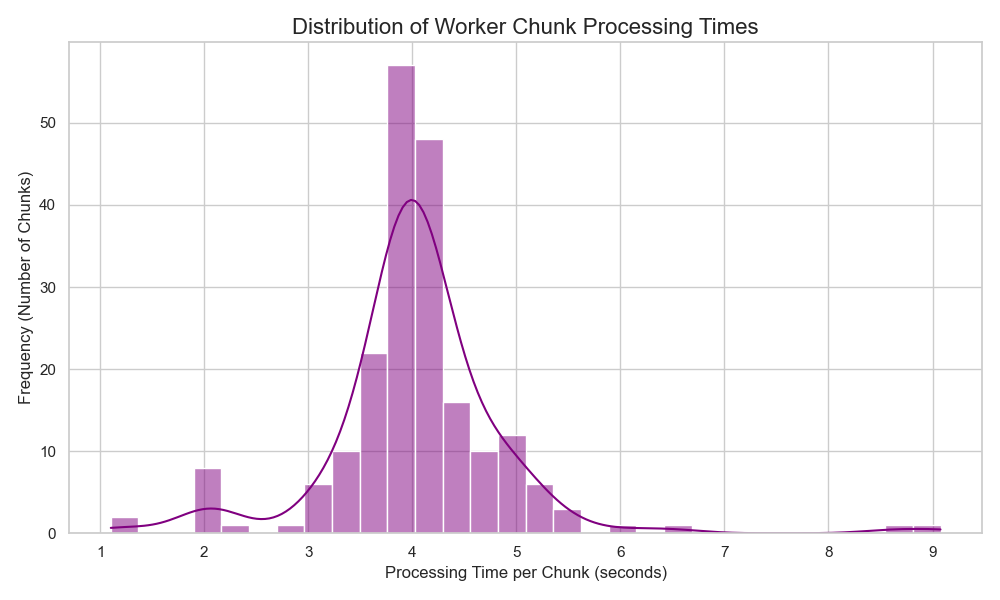
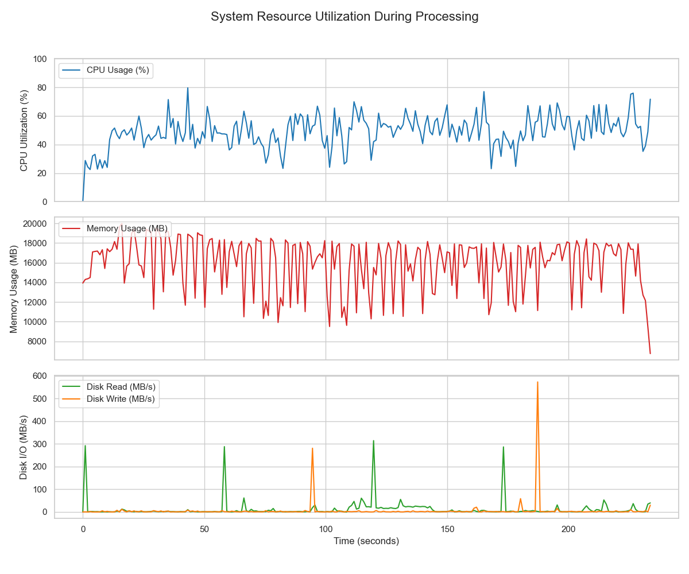
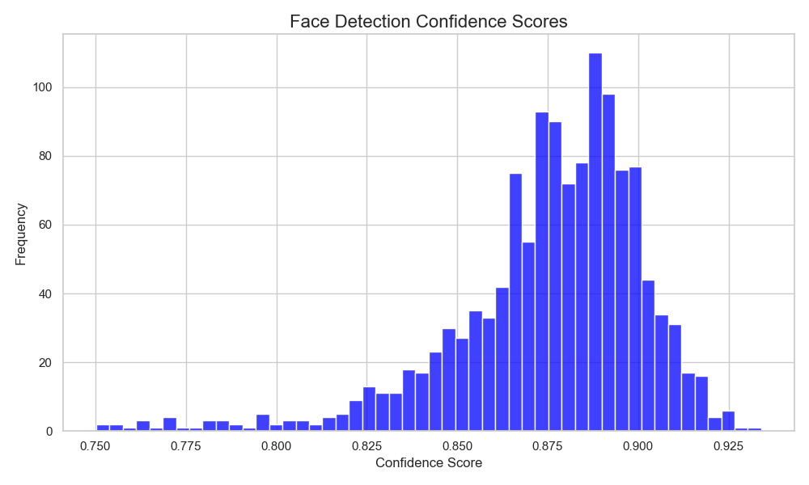
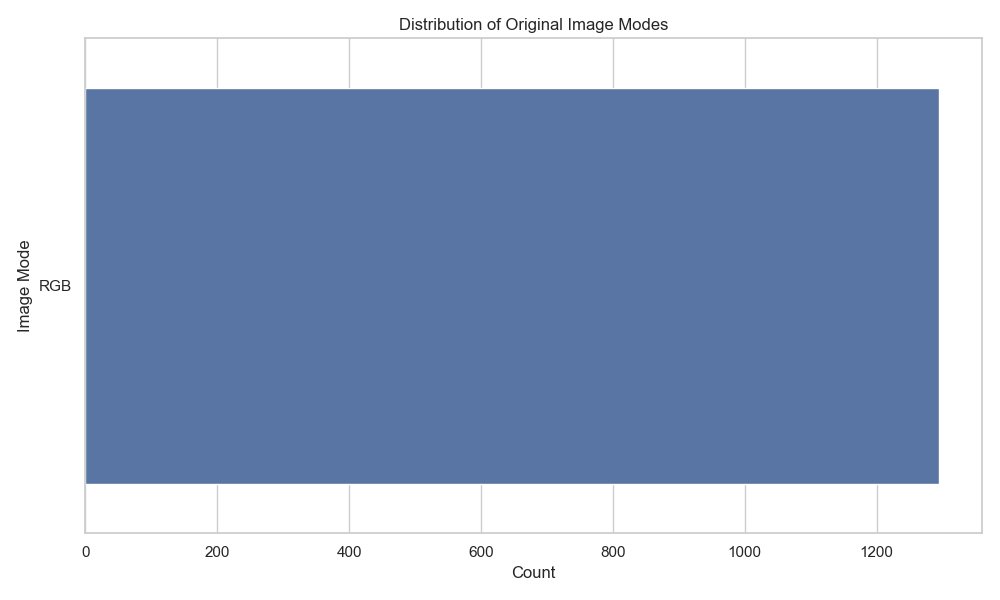
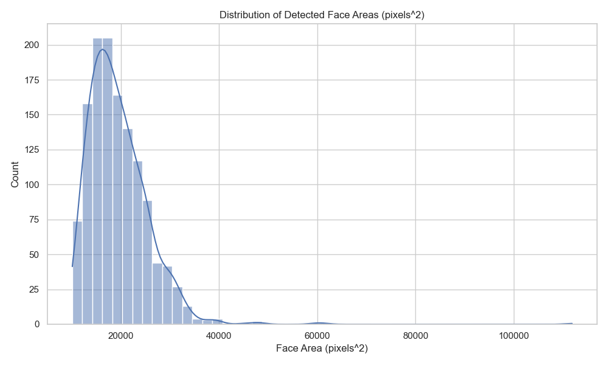
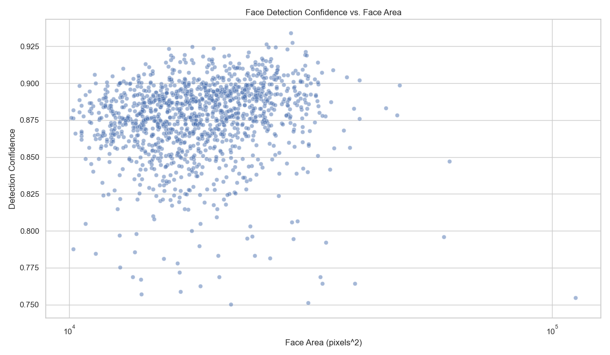

# Pipeline Run Report: run_2025-08-17_20-18-29

## 1. Run Summary
- **Git Commit Hash:** `unknown` *(not recorded at run time — do not invent a hash; reproducibility for this showcase is via run id `run_2025-08-17_20-18-29` + committed artifacts under `docs/latest_run_showcase/`)*
- **Run Command:** `scripts/process_data.py --config config/production.yaml`
- **Environment:**
```json
python_version: 3.12.8

```

## 2. Performance Dashboard
| Metric                    | Value      |
| ------------------------- | ---------- |
| Total Runtime (seconds)   | 234.39 |
| Images per Second         | 167.49     |
| Total Detection Time (s)  | 617.15 |
| Total Classification Time (s)| 36.60 |

#### 2.1. Worker Performance
| Metric (per chunk)            | Value      |
| ----------------------------- | ---------- |
| Avg. Processing Time (s)      | 4.04 |
| Std. Dev. Processing Time (s) | 0.87 |
| Min. Processing Time (s)      | 1.1 |
| Max. Processing Time (s)      | 9.08 |



### 2.2. System Resource Utilization


## 3. Data Funnel
| Stage                               | Count      |
| ----------------------------------- | ---------- |
| Total Images Processed              | 39258 |
| Images with Decoding Errors         | 0 |
| Images with No Faces                | 31990 |
| Images with Faces                   | 7268 |
| Total Faces Detected                | 15465 |
| Faces > Size Threshold              | 1295 |
| Faces Classified                    | 1295 |
| Faces with Eyeglasses (Predicted)   | 125 |
| Faces Rejected as Sunglasses        | N/A |
| **Final Target Faces**              | **125** |

### 3.1. Face Detection Diagnostics

**Key Findings:**
- **Maximum faces in single image:** 73
- **Images with multiple faces:** 2343
- **Average faces per image (images with faces):** 2.13

**Face Count Distribution:**
**Face Count Distribution Summary:**
- **Images with no faces:** 31,990 (81.5%)
- **Images with 1 face:** 4,925 (12.5%)
- **Images with 2-5 faces:** 1,854 (4.7%) - *Small groups*
- **Images with 6+ faces:** 489 (1.2%) - *Group photos/crowd scenes*
- **Highest concentration:** 73 faces in a single image

*See visualization below for complete distribution pattern.*

**Investigation Note:** The high face detection count (15465 total faces) warrants investigation. See the [High Face Count Images](./qualitative_analysis/high_face_count_images) for manual inspection of images with the most detected faces.

### 3.2. Pipeline Robustness

**Failure Tracking:**
- **Failed Inference Batches:** 0
- **Corrupted Image Batches:** 0 
- **Images in Corrupted Batches:** 0
- **Individual Decoding Errors:** 0

*These metrics help diagnose pipeline robustness and identify potential issues with batch processing, memory pressure, or data quality.*

## 4. Model Quality Analysis

### 4.1. Distributions

| Face Detection Confidence | Original Image Modes |
| :---: | :---: |
|  |  |

| Face Size Distribution | Confidence vs. Face Size |
| :---: | :---: |
|  |  |

### 4.3. Face Count Distribution (Diagnostic)


This plot shows the distribution of how many faces were detected per image. The high total face count (15465 faces) can be analyzed by examining this distribution to identify if the pipeline is processing many group photos, crowd scenes, or experiencing false positives.

### 4.4. Qualitative Samples

**Final Targets (Sample)**: A sample of faces that were correctly identified and included in the final dataset.

[Open Index](./qualitative_analysis/final_targets/index.html)

*Sunglasses rejection disabled in this run.*

**False-Negative Candidates (Sample)**: Large faces above the size threshold that were classified as non-target. Manually inspect to spot missed eyeglasses.

[Open Index](./qualitative_analysis/false_negative_candidates/index.html)

**High Face Count Images (Diagnostic)**: Images with the highest number of detected faces (>5 faces per image). These are saved for manual inspection to investigate the unexpectedly high face detection count.

[View Diagnostic Samples](./qualitative_analysis/high_face_count_images)

## 5. Full Configuration (`config.yaml`)
```yaml
paths:
  input_dir: data/raw
  output_dir: outputs/run_2025-08-17_20-18-29
  output_filename: filtered_dataset.parquet
  logs_dir: outputs/run_2025-08-17_20-18-29/logs
data_processing:
  file_pattern: train-*.parquet
  chunk_size: 512
model_params:
  face_detection:
    model_path: models/yolov8n-face-lindevs.pt
    min_face_size: 100
    min_confidence: 0.75
    keep_all: false
    target_size:
    - 224
    - 224
  classification:
    present_label: present
    output_image_format: JPEG
    eyewear_prob_threshold: 0.9
    kind: eyeglasses
    enable_sunglasses_rejection: false
    sunglasses_prob_threshold: 0.65
execution:
  num_workers: 12
  diagnostic_serial_mode: false
  inference_batch_size: 64
logging:
  level: INFO
  format: '<green>{time:YYYY-MM-DD HH:mm:ss}</green> | <level>{level: <8}</level>
    | <cyan>{name}</cyan>:<cyan>{function}</cyan>:<cyan>{line}</cyan> - <level>{message}</level>'
report_generation:
  qualitative_analysis_sample_size: 20
hardware:
  max_workers: 10
  worker_memory_limit_mb: 1500
  use_mps_acceleration: true
  device_override: null
performance:
  prefetch_chunks: 4
  gc_frequency: 10
  thread_pool_workers: 4
  batch_optimization: true
  inference_batch_size: 64
  face_classification_batch_size: 16
  max_batch_accumulation_time: 100
  rampup_enabled: true
  rampup_warmup_chunks: 4
  rampup_initial_prefetch_chunks: 1
  rampup_initial_chunk_size_override: 192
  rampup_stagger_worker_submissions_ms: 100
observability:
  detailed_metrics: false
  memory_profiling: false
  benchmark_mode: true
  performance_alerts:
    cpu_threshold: 90
    memory_threshold: 85
    min_throughput: 90.0
sampling:
  square_crop: true
  crop_margin: 0.2
  clamp_to_image: true
  pad_mode: null
  apply_to_classifier: false
run_id: run_2025-08-17_20-18-29

```
